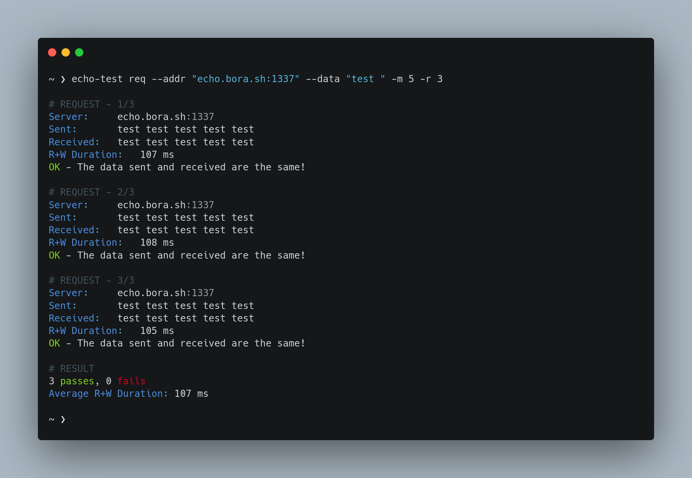

# echo-test



**`echo-test`** is a simple TCP Echo Server testing program.  

## How to build?

Build and use `./target/release/echo-test` binary.  
```sh
cargo build --release
```

## How to use it?

```
USAGE:
    echo-test request [OPTIONS] --addr <addr>... --data <data>

OPTIONS:
    -a, --addr <addr>...                   Address of the TCP server
    -d, --data <data>                      Data to sent
    -h, --help                             Print help information
    -m, --multiple-data <multiple-data>    How many times to multiple the data
    -r, --repeat <repeat>                  How many times to send the request
```

Simplest usage;  
```sh
./echo-test req --addr "echo.bora.sh:1337" --data "hello world"
```

Multiple the data, like `"hey" * 50`;  
```sh
./echo-test req --addr "echo.bora.sh:1337" --data "hello world" --multiple-data 50
```

Repeat the request;  
```sh  
./echo-test req --addr "echo.bora.sh:1337" --data "hello world" --repeat 5
```

Use multiple servers;  
```sh
./echo-test req --addr "echo.bora.sh:1337,echo.bora.sh:1338" --data "hello world"
```

## Copyright

[MIT license](https://github.com/boratanrikulu/echo-test/blob/main/LICENSE),  
Copyright 2022 Bora Tanrikulu <[me@bora.sh](mailto:me@bora.sh)>
